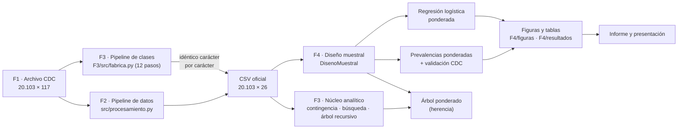
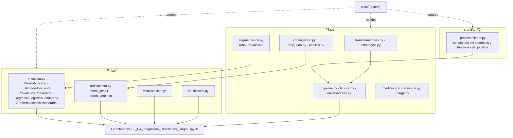
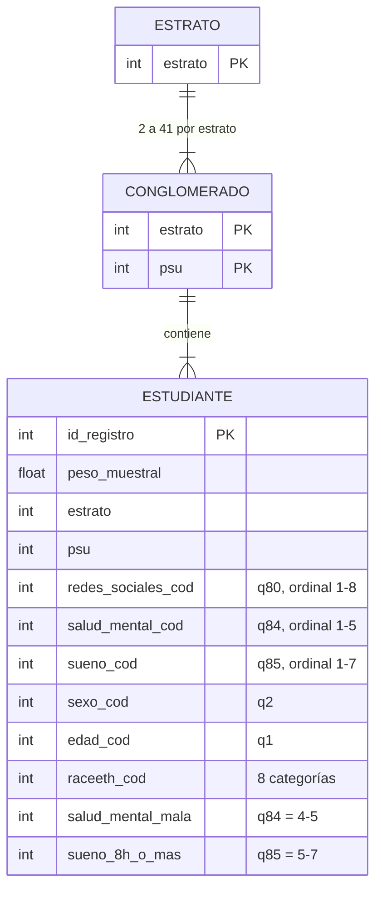

# Arquitectura del proyecto — Grupo 8, MCDI500

Documento de arquitectura del sistema analítico al cierre de la Fase 4. Sigue la estructura
de la infografía del curso *Documentación profesional de arquitectura en ciencia de datos*:
objetivo y contexto, entradas y salidas, lógica, dependencias y cuatro diagramas (flujo,
componentes, secuencia y datos). Los diagramas están escritos en Mermaid: GitHub los dibuja
directamente.

## 1. Objetivo y contexto

Estimar la relación entre la frecuencia de uso de redes sociales (`q80`) y la salud mental
autopercibida (`q84`) y el sueño (`q85`) en los estudiantes del YRBS 2023, con estimaciones
representativas de la población (pesos, estratos y conglomerados) y un flujo reproducible.
Usuarios: el equipo, el docente y cualquier persona que clone el repositorio.

## 2. Diagrama de flujo (pipeline paso a paso)



## 3. Diagrama de componentes (vista estructural)



Regla de dependencias: cada capa importa solo de las anteriores (`src/` ← `F3/src/` ←
`F4/src/` ← notebook). No hay ciclos y el notebook no define clases (se comprueba en su
sección 12).

## 4. Diagrama de secuencia (una estimación ponderada)

```mermaid
sequenceDiagram
    participant NB as Notebook F4
    participant D as DisenoMuestral
    participant P as PrevalenciaPonderada
    NB->>D: DisenoMuestral(datos)
    D-->>NB: valida pesos > 0, sin NA, ≥ 2 conglomerados por estrato
    NB->>P: estimar(datos, "salud_mental_mala", por="redes_sociales_cod")
    loop por cada nivel de q80
        P->>P: p = Σw·y / Σw ; z = w·(y − p)/Σw (0 fuera del dominio)
        P->>D: varianza(z)
        D-->>P: Σ_h n_h/(n_h−1) Σ_j (Z_hj − Z̄_h)²  (np.bincount)
        P->>D: t_critico(0,95)  (73 gl)
        P->>P: IC en escala logit
    end
    P-->>NB: DataFrame: n, % muestral, % ponderado, EE, IC, deff
```

## 5. Diagrama de datos



## 6. Entradas y salidas por componente

| Componente | Recibe | Produce |
|---|---|---|
| `construir_pipeline_proyecto()` | archivo CDC 20.103 × 117 | DataFrame 20.103 × 26 (idéntico al CSV de F2) |
| `DisenoMuestral` | DataFrame con peso, estrato y psu | 16 estratos, 89 conglomerados, 73 gl; `varianza(z)` |
| `PrevalenciaPonderada.estimar` | DataFrame, indicador 0/1, grupos | tabla con n, % muestral, % ponderado, EE, IC 95 %, deff |
| `RegresionLogisticaPonderada.estimar` | DataFrame, desenlace, matriz X | odds ratios con IC 95 % y valor *p* |
| `ArbolPrevalenciaPonderada.tabla` | DataFrame, jerarquía, diseño | segmentos con % muestral y ponderado |
| `medir_timeit`, `orden_empirico`, `punto_de_cruce` | dict de implementaciones | tiempos mínimos, razones, pendiente log-log y tamaño desde el que una versión supera a otra |
| `visualizacion.grafico_*` | copia interpretable (`tabla_visual`): etiquetas, orden ordinal y n por grupo | PNG en `F4/figuras/`, una figura por objetivo específico |
| `ejecutar_notebooks` | rutas de notebooks | estado, celdas y segundos de cada ejecución |

## 7. Dependencias y tecnologías

Python 3.13, pandas 3.0.6, NumPy 2.5.3, SciPy 1.17.1 (cuantil *t*), Matplotlib 3.11.2,
Seaborn 0.13.2, pytest 9.1.1, nbclient 0.11.0; versiones fijadas en `requirements.txt`.

## 8. Decisiones de arquitectura

Ver `docs/adr/`. Cada ADR registra contexto, decisión, alternativas descartadas y consecuencias.
